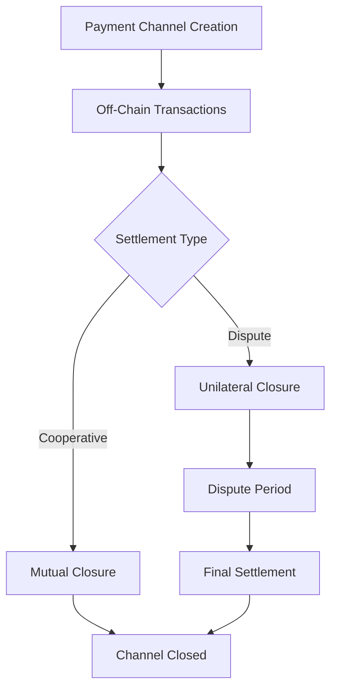

# FlowVault: Decentralized Payment Channel Infrastructure

[](https://docs.stacks.co/docs/clarity/)
[](LICENSE)
[](https://github.com/your-username/flow-vault)

A cutting-edge peer-to-peer payment channel system built on Stacks that revolutionizes digital transactions through trustless, high-speed settlement mechanisms. FlowVault enables seamless value transfer with cryptographic guarantees and zero network fees for off-chain transactions.

## 🌟 Features

### Core Capabilities

- **⚡ Instantaneous Payments**: Zero-fee bilateral payment processing with instant settlement
- **📈 Unlimited Scalability**: Off-chain transaction routing for unlimited throughput
- **🔒 Cryptographic Security**: Mathematically provable security through cryptographic commitments
- **💧 Dynamic Liquidity**: Flexible channel funding with real-time capacity management
- **⚖️ Dispute Resolution**: Robust arbitration with economic game theory incentives
- **🛡️ Emergency Recovery**: Fail-safe protocols for exceptional circumstances

### Transformative Applications

- 🛒 **E-commerce**: Subscription platforms with recurring micropayments
- 🎮 **Gaming**: Decentralized gaming economies with instant transactions
- 🌐 **IoT**: Machine-to-machine micropayments for IoT devices
- 🎨 **Content**: Creator monetization with pay-per-view models
- 💱 **DeFi**: High-frequency protocols requiring instant finality

## 🏗️ System Architecture



### Core Components

1. **Payment Channels**: Bidirectional funding escrow between participants
2. **Cryptographic Commitments**: Secure off-chain transaction validation
3. **Dispute Mechanism**: Time-locked unilateral closure with fraud protection
4. **Emergency System**: Owner-controlled fund recovery for critical situations

## 🚀 Quick Start

### Prerequisites

```bash
# Install Clarinet
curl -L https://github.com/hirosystems/clarinet/releases/latest/download/clarinet-linux-x64.tar.gz | tar xz
sudo mv clarinet /usr/local/bin/

# Verify installation
clarinet --version
```

### Installation

```bash
# Clone the repository
git clone https://github.com/your-username/flow-vault.git
cd flow-vault

# Initialize project
clarinet new flow-vault
cd flow-vault

# Copy the contract
cp ../1.clar contracts/flow-vault.clar
```

### Development Setup

```bash
# Check contract syntax
clarinet check

# Run tests
clarinet test

# Start development console
clarinet console
```

## 📋 Contract Interface

### Channel Management

#### Create Channel

Creates a new bidirectional payment channel between two participants.

```clarity
(contract-call? .flow-vault create-channel 
  0x1234567890abcdef1234567890abcdef12345678  ;; channel-id
  'ST1PQHQKV0RJXZFY1DGX8MNSNYVE3VGZJSRTPGZGM   ;; participant-b
  u1000000)                                    ;; initial-deposit (1 STX)
```

#### Fund Channel

Add additional liquidity to an existing channel.

```clarity
(contract-call? .flow-vault fund-channel
  0x1234567890abcdef1234567890abcdef12345678  ;; channel-id
  'ST1PQHQKV0RJXZFY1DGX8MNSNYVE3VGZJSRTPGZGM   ;; participant-b
  u500000)                                     ;; additional-funds (0.5 STX)
```

### Channel Closure

#### Cooperative Closure

Mutual channel closure with both parties' signatures.

```clarity
(contract-call? .flow-vault close-channel-cooperative
  0x1234567890abcdef1234567890abcdef12345678  ;; channel-id
  'ST1PQHQKV0RJXZFY1DGX8MNSNYVE3VGZJSRTPGZGM   ;; participant-b
  u800000                                      ;; balance-a
  u700000                                      ;; balance-b
  0x304502...                                  ;; signature-a
  0x304502...)                                 ;; signature-b
```

#### Unilateral Closure

Force-close channel when cooperation fails.

```clarity
;; Initiate unilateral closure
(contract-call? .flow-vault initiate-unilateral-close
  0x1234567890abcdef1234567890abcdef12345678  ;; channel-id
  'ST1PQHQKV0RJXZFY1DGX8MNSNYVE3VGZJSRTPGZGM   ;; participant-b
  u800000                                      ;; proposed-balance-a
  u700000                                      ;; proposed-balance-b
  0x304502...)                                 ;; signature

;; Resolve after dispute period (1008 blocks ≈ 1 week)
(contract-call? .flow-vault resolve-unilateral-close
  0x1234567890abcdef1234567890abcdef12345678  ;; channel-id
  'ST1PQHQKV0RJXZFY1DGX8MNSNYVE3VGZJSRTPGZGM)  ;; participant-b
```

### Information Queries

#### Get Channel Information

Retrieve complete channel state.

```clarity
(contract-call? .flow-vault get-channel-info
  0x1234567890abcdef1234567890abcdef12345678  ;; channel-id
  'ST1PQHQKV0RJXZFY1DGX8MNSNYVE3VGZJSRTPGZGM   ;; participant-a
  'ST2CY5V39NHDPWSXMW9QDT3HC3GD6Q6XX4CFRK9AG)  ;; participant-b
```

## 🔒 Security Model

### Access Control

- **Channel Creation**: Open to all users
- **Channel Operations**: Restricted to channel participants
- **Emergency Functions**: Contract owner only

### Cryptographic Guarantees

- **Signature Verification**: All state transitions require valid signatures
- **Fund Conservation**: Mathematical proof of balance preservation
- **Dispute Protection**: Time-locked mechanisms prevent fraud

### Economic Incentives

- **Cooperative Closure**: Instant settlement with mutual agreement
- **Dispute Resolution**: Economic penalties for malicious behavior
- **Emergency Recovery**: Last resort fund protection

## 🛠️ Error Handling

| Code | Constant | Description |
|------|----------|-------------|
| `u100` | `ERR-NOT-AUTHORIZED` | Unauthorized access attempt |
| `u101` | `ERR-CHANNEL-EXISTS` | Channel already exists |
| `u102` | `ERR-CHANNEL-NOT-FOUND` | Channel does not exist |
| `u103` | `ERR-INSUFFICIENT-FUNDS` | Insufficient balance for operation |
| `u104` | `ERR-INVALID-SIGNATURE` | Invalid cryptographic signature |
| `u105` | `ERR-CHANNEL-CLOSED` | Operation on closed channel |
| `u106` | `ERR-DISPUTE-PERIOD` | Dispute period validation failed |
| `u107` | `ERR-INVALID-INPUT` | Invalid input parameters |

## 📊 Performance Metrics

### Transaction Costs

- **Channel Creation**: ~1,000 µSTX
- **Channel Funding**: ~800 µSTX
- **Cooperative Closure**: ~1,200 µSTX
- **Unilateral Closure**: ~1,500 µSTX

### Scalability

- **Off-chain TPS**: Unlimited
- **Settlement Time**: Instant (cooperative) / 1 week (disputed)
- **Channel Capacity**: No theoretical limit

## 🧪 Testing

### Unit Tests

```bash
# Run comprehensive test suite
clarinet test

# Test specific functionality
clarinet test --filter="test-create-channel"
```

### Integration Tests

```bash
# Test full channel lifecycle
clarinet test tests/integration/channel-lifecycle.test.ts

# Test dispute resolution
clarinet test tests/integration/dispute-resolution.test.ts
```

### Security Tests

```bash
# Run security audit tests
clarinet test tests/security/

# Test emergency scenarios
clarinet test tests/security/emergency-scenarios.test.ts
```

## 🚀 Deployment

### Testnet Deployment

```bash
# Configure testnet settings
cat > settings/Testnet.toml << EOF
[network]
name = "testnet"

[accounts.deployer]
mnemonic = "your testnet mnemonic here"
balance = 100_000_000_000

[[requirements]]
contract_id = "SP000000000000000000002Q6VF78.pox"
EOF

# Deploy to testnet
clarinet deployments apply --testnet
```

### Mainnet Deployment

```bash
# Configure mainnet settings (use hardware wallet)
clarinet deployments apply --mainnet
```

## 🔧 Configuration

### Channel Parameters

- **Dispute Period**: 1008 blocks (~7 days)
- **Minimum Deposit**: 1 µSTX
- **Maximum Channel ID**: 32 bytes

### Security Settings

- **Emergency Withdrawal**: Contract owner only
- **Signature Validation**: ECDSA with secp256k1
- **Fund Conservation**: Mathematically enforced

## 📖 Documentation

### Developer Resources

- [Clarity Language Guide](https://docs.stacks.co/docs/clarity/)
- [Stacks Blockchain API](https://docs.hiro.so/api/)
- [Payment Channel Theory](docs/payment-channels.md)

### API Reference

- [Contract Functions](docs/api-reference.md)
- [Error Codes](docs/error-codes.md)
- [Security Model](docs/security.md)

## 🤝 Contributing

We welcome contributions! Please see our [Contributing Guide](CONTRIBUTING.md) for details.

### Development Workflow

1. Fork the repository
2. Create a feature branch (`git checkout -b feature/amazing-feature`)
3. Write tests for your changes
4. Ensure all tests pass (`clarinet test`)
5. Commit your changes (`git commit -m 'Add amazing feature'`)
6. Push to the branch (`git push origin feature/amazing-feature`)
7. Open a Pull Request

### Code Standards

- Follow Clarity best practices
- Add comprehensive tests
- Update documentation
- Use meaningful commit messages

## 🐛 Bug Reports

Please report bugs via [GitHub Issues](https://github.com/your-username/flow-vault/issues) with:

- Clear description of the issue
- Steps to reproduce
- Expected vs actual behavior
- Environment details

## 📝 License

This project is licensed under the MIT License - see the [LICENSE](LICENSE) file for details.

## 🙏 Acknowledgments

- [Stacks Foundation](https://stacks.org/) for the blockchain infrastructure
- [Hiro Systems](https://hiro.so/) for Clarity development tools
- Lightning Network for payment channel inspiration

---

## Built with ❤️ on Stacks
